```mermaid
%%{
  init: {
    'theme': 'base',
    'themeVariables': {
      'primaryColor': '#000000',
      'primaryTextColor': '#fff',
      'primaryBorderColor': '#22c55e',
      'lineColor': '#4ade80',
      'secondaryColor': '#111827',
      'tertiaryColor': '#1f2937',
      'noteBkgColor': '#064e3b',
      'noteTextColor': '#fff',
      'noteBorderColor': '#22c55e'
    }
  }
}%%
sequenceDiagram
    participant User
    participant Supabase as Supabase Auth
    participant DB as Database (Public)
    participant Front as Frontend

    User->>Supabase: 1. Login (Google) or Signup
    
    rect rgb(20, 20, 20)
        Note right of Supabase: ⚡ DB TRIGGER ⚡
        Supabase->>DB: 2. on_auth_user_created()
        DB->>DB: 3. INSERT (onboarding: false)
    end
    
    Supabase-->>Front: 4. Session Token
    
    Front->>DB: 5. Check Profile Status
    DB-->>Front: User exists, onboarding=false
    
    Front->>User: 6. Redirect -> /dashboard/onboarding
    
    User->>Front: 7. Submits Form (Name, etc.)
    Front->>DB: 8. UPDATE users SET onboarding=true
    
    Front->>User: 9. Redirect -> /dashboard
```

---

```mermaid
%%{
  init: {
    'theme': 'base',
    'themeVariables': {
      'primaryColor': '#000000',
      'primaryTextColor': '#fff',
      'primaryBorderColor': '#22c55e',
      'lineColor': '#4ade80',
      'secondaryColor': '#111827',
      'tertiaryColor': '#1f2937',
      'noteBkgColor': '#064e3b',
      'noteTextColor': '#fff',
      'noteBorderColor': '#22c55e'
    }
  }
}%%
sequenceDiagram
    participant User
    participant App
    participant Supabase

    Note over User, Supabase: Scenario: User Signed up with Google, now wants Password login

    User->>App: Tries to Login (Email + Password)
    Supabase-->>App: ❌ Error: Invalid Login Credentials
    App-->>User: "Login failed"

    User->>App: Clicks "Forgot Password"
    App->>Supabase: resetPasswordForEmail(user@gmail.com)
    Supabase-->>User: 📧 Sends Email Link

    User->>App: Clicks Email Link (Logs them in temporarily)
    User->>App: Enters NEW Password
    App->>Supabase: updateUser({ password: "newPass123" })
    Supabase-->>App: ✅ Password Set

    Note over User, Supabase: Now User can login with Google OR Password
  ```