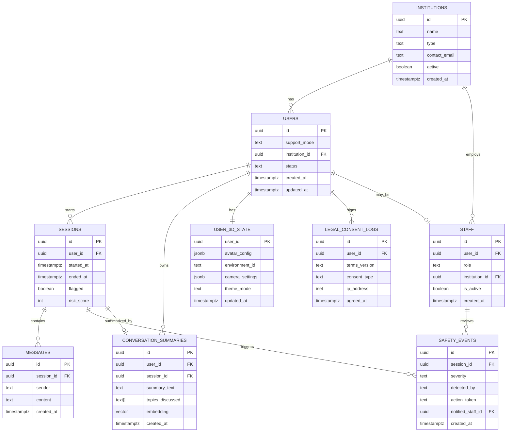

# Entity Relationship Diagram (ERD)
## 3D AI Mental Wellness Chatbot

This ER diagram is written using Mermaid JS.
It accurately reflects the production database schema (`schema.sql`).

---

---

## Notes

- This diagram matches the current production database schema.
- All relationships are enforced using foreign keys and Row Level Security (RLS).
- Staff visibility is restricted at the policy level, not represented directly in the ER diagram.
- Supports both self-help users and institutional users.
- Mermaid diagrams render automatically on GitHub and many Markdown viewers.

---

## Status

- ✔ Final
- ✔ Synced with `schema.sql`
- ✔ Production ready
- ✔ Viva friendly

---

## GitHub Rendering Tip

GitHub natively supports Mermaid diagrams.

If the diagram does not render in your local editor, view the file directly on GitHub or use a Markdown viewer with Mermaid support.

---

## Next Steps

Optional follow-up diagrams that can be added:

- Role and permission annotations for the ER diagram
- Sequence diagram for chatbot conversation flow
- System architecture diagram using Mermaid

Choose based on documentation needs.
