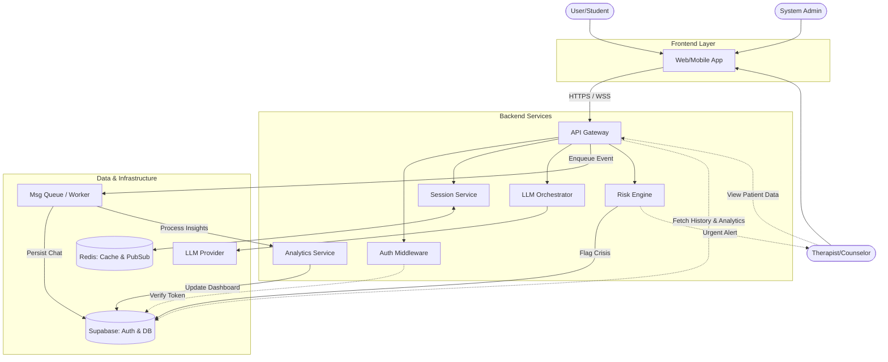

# 3D AI Chatbot MVP – Pre-Coding Design Document

> This document defines design decisions, system contracts, failure policies, and API structure **before implementation**.
> It is intentionally explicit to avoid refactors and ambiguity during development.

---

## 1. Purpose and Scope

This document describes the design of a **3D AI Chatbot MVP** covering backend, frontend, LLM integration, safety, and observability.

### In Scope

* Session-based AI chat
* Safety and escalation handling
* Admin observability
* 3D avatar frontend integration
* Docker-based local deployment

### Out of Scope

* Kubernetes or orchestration
* Multi-region deployment
* Multi-LLM routing
* Enterprise IAM

---

## 2. Environment and Secrets Management

### Environment Separation

* Root level tooling
* Backend runtime
* Frontend build/runtime

### Backend Environment Variables

| Variable             | Purpose                 | Required |
| -------------------- | ----------------------- | -------- |
| OPENAI_API_KEY       | LLM access              | Yes      |
| REDIS_URL            | Session and cache store | Yes      |
| SUPABASE_URL         | Persistent storage      | Yes      |
| SUPABASE_SERVICE_KEY | Admin access            | Yes      |
| LOG_LEVEL            | Logging verbosity       | No       |

### Frontend Environment Variables

| Variable                      | Purpose              | Required |
| ----------------------------- | -------------------- | -------- |
| NEXT_PUBLIC_API_BASE_URL      | Backend API base URL | Yes      |
| NEXT_PUBLIC_SUPABASE_URL      | Client auth          | Yes      |
| NEXT_PUBLIC_SUPABASE_ANON_KEY | Client auth          | Yes      |

### Policy

* No secrets committed to VCS
* `.env.example` files must exist
* Secrets injected at runtime

---

## 3. Observability and Logging

### Logging Format

* Structured JSON logs
* One log entry per event

### Mandatory Log Fields

* timestamp
* level
* request_id
* service
* message
* metadata (optional)

### Request Tracing

* `request_id` generated at request entry
* Propagated through routers and services
* Included in logs and error responses

### Policy

* No silent failures
* All errors logged with request_id

---

## 4. LLM Failure and Timeout Policy

### Timeout Strategy

* LLM timeout: **10 seconds**

### Retry Strategy

* One retry on transient failures
* No exponential backoff for MVP

### Failure Handling

If the LLM fails after retry:

* Return a safe fallback response
* Do not expose internal errors
* Log failure with request_id

### User-Visible Fallback

A neutral message prompting the user to retry later.

---

## 5. Session Lifecycle Management

### Session Creation

* Created on first user message

### Storage

* Redis
* Identified by `session_id`

### TTL Policy

* 30 minutes of inactivity
* TTL refreshed on each user message

### Expiration Behavior

* Expired sessions cannot be resumed
* User must start a new session

### Redis Failure

* Redis flush or restart ends sessions gracefully

### Lifecycle State Machine

```
CREATED -> ACTIVE -> EXPIRED
```

---

## 6. Safety and Escalation Model

### Risk Evaluation

* Every message evaluated by risk service
* Risk levels: low, medium, high

### Escalation Triggers

* High-risk classification
* Repeated medium-risk patterns

### Escalation Behavior

* Session marked as escalated
* Event persisted in Supabase
* Immutable audit record

### Escalation Record Schema

* session_id
* risk_level
* trigger_reason
* timestamp

### Access Control

* Admin-only read access
* No modification after creation

---

## 7. Frontend UI States

| State           | Trigger         | UI Behavior             |
| --------------- | --------------- | ----------------------- |
| Loading         | Waiting for LLM | Spinner, input disabled |
| Timeout         | LLM exceeds 10s | Retry prompt            |
| Network Error   | API failure     | Error banner            |
| Session Expired | TTL exceeded    | Restart prompt          |
| Escalated       | Safety trigger  | Crisis notice           |

### Policy

* No infinite spinners
* Every failure must be visible to the user

---

## 8. CI and Quality Gates

### Required Checks

* Backend tests must pass
* Frontend must build successfully

### Commands

```
pytest
npm run build
```

### Merge Policy

* No merge if any required check fails

---

## 9. API Design

### Public Chat APIs

| Method | Endpoint                  | Description            |
| ------ | ------------------------- | ---------------------- |
| POST   | /api/v1/chat/message      | Send user message      |
| GET    | /api/v1/chat/session/{id} | Fetch session messages |
| POST   | /api/v1/chat/session      | Create new session     |

### Admin APIs

| Method | Endpoint                    | Description        |
| ------ | --------------------------- | ------------------ |
| GET    | /api/v1/admin/sessions      | List sessions      |
| GET    | /api/v1/admin/sessions/{id} | Session details    |
| GET    | /api/v1/admin/escalations   | Escalated sessions |

---

## 10. System Design Diagram



---

## 11. Non-Goals for MVP

* Horizontal scaling
* Vector databases
* Fine-tuned models
* Multi-tenant isolation

---

## 12. Guiding Principles

* Explicit failure over silent success
* Safety over response quality
* Clarity over cleverness
* MVP correctness over feature depth

---

## Completion Criteria

* Document reviewed before coding
* Implementation must follow this contract
* Any deviation req
